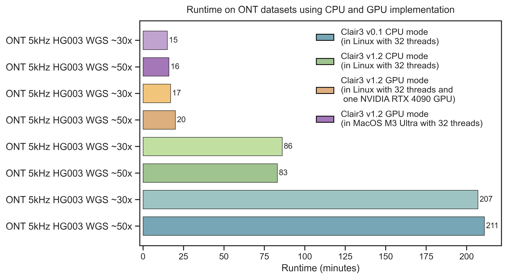

<div align="center">
  <a href="https://en.wiktionary.org/wiki/%E7%9C%BC" target="_blank">
    
  </a>

  <h1>Clair3</h1>

  <p><b>Symphonizing pileup and full-alignment for deep-learning-based long-read variant calling</b></p>

  <p>
    <a href="https://opensource.org/licenses/BSD-3-Clause"></a>
    <a href="http://bioconda.github.io/recipes/clair3/README.html"></a>
    <a href="https://hub.docker.com/r/hkubal/clair3"></a>
  </p>

  <p><b>Papers</b></p>
</div>

| Paper | Venue | Topic |
| --- | --- | --- |
| Symphonizing pileup and full-alignment for deep learning-based long-read variant calling | [Nature Computational Science](https://rdcu.be/c1TPa) · [bioRxiv preprint](https://www.biorxiv.org/content/10.1101/2021.12.29.474431v2) | Original Clair3 |
| Accelerated long-read variant calling with Clair3 for whole-genome sequencing | [Bioinformatics, 2026](https://doi.org/10.1093/bioinformatics/btag181) | GPU-accelerated Clair3 |
| Leveraging ONT move table values for signal aware variant calling | [bioRxiv preprint, 2026](https://www.biorxiv.org/content/10.64898/2026.02.13.705285v1) | ONT `mv`-tag (move-table) signal-aware tuning |

---

**Contact:** Ruibang Luo, Zhenxian Zheng, Xian Yu
**Email:** rbluo@cs.hku.hk · zxzheng@cs.hku.hk · yuxian@connect.hku.hk

---

## Introduction

**Clair3** is a germline small-variant caller for long-read sequencing. It combines two complementary models to balance speed and accuracy:

- **Pileup calling** — fast, handles the majority of variant candidates from summarized alignment statistics.
- **Full-alignment calling** — computationally intensive, resolves uncertain candidates from haplotype-resolved full alignments.

Clair3 is the 3rd generation of [Clair](https://github.com/HKU-BAL/Clair) (2nd) and [Clairvoyante](https://github.com/aquaskyline/Clairvoyante) (1st).

### Looking for a different variant caller?

| Use case | Tool |
| --- | --- |
| Germline on **long-read RNA-seq** | [Clair3-RNA](https://github.com/HKU-BAL/Clair3-RNA) |
| Somatic, **paired tumor/normal** | [ClairS](https://github.com/HKU-BAL/ClairS) |
| Somatic, **tumor-only** | [ClairS-TO](https://github.com/HKU-BAL/ClairS-TO) |
| **Agentic AI skill** (Claude Code, Cursor, Codex…) for the Clair suite | [Clair-skills](https://github.com/HKU-BAL/Clair-skills) |

---

## Contents

- [Latest Updates](#latest-updates)
- [Pre-trained Models](#pre-trained-models)
- [Installation](#installation) — [Conda](#option-1-build-an-environment-with-mambaconda) · [Docker](#option-2-docker-pre-built-image) · [Singularity](#option-3-singularity)
- [Quick Demo](#quick-demo)
- [Usage](#usage)
- [Advanced Topics](#advanced-topics) — [Dwelling time](#dwelling-time-feature) · [Amplicon data](#dealing-with-amplicon-data) · [Postprocessing](#postprocessing-scripts)
- [Reference](#reference) — [Folder structure](#folder-structure-and-submodules) · [Training data](#training-data) · [VCF/GVCF formats](#vcfgvcf-output-formats) · [Model training guides](#model-training-guides)

---

## Latest Updates

### v2.0.0 — *Feb 9, 2026* &nbsp; **(Major release)**

A preprint describing the performance of Clair3 v2 is available on [bioRxiv](https://www.biorxiv.org/content/10.64898/2026.02.13.705285v1).

- **PyTorch migration.** The deep-learning backend moved from TensorFlow to PyTorch. **v1 TensorFlow models are _not_ compatible with v2** (including the TF models ONT provides via Rerio). Use the [Converted Rerio Clair3 Models (PyTorch)](https://www.bio8.cs.hku.hk/clair3/clair3_models_rerio_pytorch/), or convert your own with the [Model Migration Guide](docs/model_migration_guide.md). Pre-trained PyTorch models: [download here](https://www.bio8.cs.hku.hk/clair3/clair3_models_pytorch/).
- **Signal-aware variant calling for ONT.** Pass `--enable_dwell_time` on BAMs with Dorado `mv` tags (requires `--emit-moves`). See [Dwelling Time Feature](docs/dwelling_time.md).
- **New Python runner.** `run_clair3.sh` was reconstructed as `run_clair3.py`; both remain usable.
- **Checkpoint format.** TF `.index`/`.data` → PyTorch `.pt`.

### v1.2.0 — *Aug 1, 2025*

Native GPU support on Linux and Apple Silicon. Clair3 on GPU runs **~5× faster than CPU**. See the [GPU Quick Start](docs/gpu_quick_start.md).

<div align="center">
  
</div>

### v1.1.2 — *Jul 10, 2025*

- Boundary check for an insertion immediately followed by soft-clipping ([#394](https://github.com/HKU-BAL/Clair3/issues/394), @[dpryan79](https://github.com/dpryan79)).
- Parallel-job exit-code checking; pipeline now exits immediately on any job failure ([#392](https://github.com/HKU-BAL/Clair3/issues/392), @[SamStudio8](https://github.com/SamStudio8)).

### v1.1.1 — *May 19, 2025*

- Fixed the malformed VCF header on AWS ([#380](https://github.com/HKU-BAL/Clair3/issues/380)).
- Added an R10.4.1 model fine-tuned on 12 [bacterial genomes](https://elifesciences.org/reviewed-preprints/98300) ([notes](docs/fine-tuning_Clair3_with_12_bacteria_samples.pdf), @[wshropshire](https://github.com/wshropshire)).

<details>
<summary><b>Earlier versions</b> (click to expand)</summary>

**v1.1.0 — Apr 8, 2025.** Removed `parallel` version checking ([#377](https://github.com/HKU-BAL/Clair3/issues/377)).

**v1.0.11 — Mar 19, 2025.** Added `--enable_variant_calling_at_sequence_head_and_tail` to call variants in the first/last 16 bp of a sequence (use with caution — less reliable alignments and less context; [#257](https://github.com/HKU-BAL/Clair3/issues/257)). Added `--output_all_contigs_in_gvcf_header` ([#371](https://github.com/HKU-BAL/Clair3/issues/371)). Added postprocessing `AddPairEndAlleleDepth` (PEAD tag, Bin Guan, NEI). Fixed AF format in GVCF output ([#365](https://github.com/HKU-BAL/Clair3/issues/365)). Added a [split-into-haplotypes calling workflow](docs/split_haplotype_into_haploid_calling.md). `set -o pipefail` in `run_clair3.sh` ([#368](https://github.com/HKU-BAL/Clair3/issues/368)). Clarified parameter docs ([#369](https://github.com/HKU-BAL/Clair3/issues/369)).

**v1.0.10 — Jul 28, 2024.** Fixed an out-of-range bug in non-human GVCF output ([#317](https://github.com/HKU-BAL/Clair3/issues/317)). Faster amplicon calling via `--chunk_num=-1` ([#306](https://github.com/HKU-BAL/Clair3/issues/306)). LongPhase bumped to 1.7.3 ([#321](https://github.com/HKU-BAL/Clair3/issues/321)).

**v1.0.9 — May 15, 2024.** Fixed VCF header ([#305](https://github.com/HKU-BAL/Clair3/pull/305)); updated `DP` FORMAT description.

**v1.0.8 — Apr 29, 2024.** Fixed occasional quality-score differences between VCF and GVCF output. LongPhase bumped to 1.7.

**v1.0.7 — Apr 7, 2024.** Memory guards for full-alignment C implementation ([#286](https://github.com/HKU-BAL/Clair3/pull/286)). Raised max mpileup coverage to 2^20 ([#292](https://github.com/HKU-BAL/Clair3/pull/292)). LongPhase bumped to 1.6.

**v1.0.6 — Mar 15, 2024.** Stack-overflow fix at very high coverage ([#282](https://github.com/HKU-BAL/Clair3/issues/282)). Reference caching for CRAM ([#278](https://github.com/HKU-BAL/Clair3/pull/278)). Fixed RefCall outputs when FA model calls no variant ([#271](https://github.com/HKU-BAL/Clair3/issues/271)). Fixed min-coverage filtering ([#262](https://github.com/HKU-BAL/Clair3/issues/262)). `--min_snp_af` / `--min_indel_af` default to 0.0 when `--vcf_fn` is set ([#261](https://github.com/HKU-BAL/Clair3/issues/261)).

**v1.0.5 — Dec 20, 2023.** Fixed multi-allelic AF at very high coverage ([#241](https://github.com/HKU-BAL/Clair3/issues/241)). `--base_err` and `--gq_bin_size` to reduce excess `./.` in GVCF ([#220](https://github.com/HKU-BAL/Clair3/issues/220)).

**v1.0.4 — Jul 11, 2023.** Command line and reference source now in VCF header. Fixed AF for 1/2 genotypes. Added AD tag.

**v1.0.3 — Jun 20, 2023.** Colon `:` allowed in reference sequence names ([#203](https://github.com/HKU-BAL/Clair3/issues/203)).

**v1.0.2 — May 22, 2023.** Added PacBio HiFi Revio model. Fixed halt on too few variant candidates ([#198](https://github.com/HKU-BAL/Clair3/issues/198)).

**v1.0.1 — Apr 24, 2023.** WhatsHap bumped to 1.7 (~15% faster haplotagging, [#193](https://github.com/HKU-BAL/Clair3/issues/193)). Fixed PL when ALT is N ([#191](https://github.com/HKU-BAL/Clair3/issues/191)).

**v1.0.0 — Mar 6, 2023.** Clair3 version in VCF header ([#141](https://github.com/HKU-BAL/Clair3/issues/141)). NumPy int fix ([#165](https://github.com/HKU-BAL/Clair3/issues/165)). IUPAC → N by default, keep with `--keep_iupac_bases` ([#153](https://github.com/HKU-BAL/Clair3/issues/153)). Added `--use_{longphase,whatshap}_for_intermediate_phasing` / `--use_{longphase,whatshap}_for_final_output_phasing` / `--use_whatshap_for_final_output_haplotagging` ([#164](https://github.com/HKU-BAL/Clair3/issues/164)). Fixed Docker shell under host user mode ([#175](https://github.com/HKU-BAL/Clair3/issues/175)).

**v0.1-r12 — Aug 19, 2022.** CRAM input ([#117](https://github.com/HKU-BAL/Clair3/issues/117)). Python 3.9, TensorFlow 2.8, Samtools 1.15.1, WhatsHap 1.4. `DP` now shows raw coverage for pileup calls ([#128](https://github.com/HKU-BAL/Clair3/issues/128)). Illumina representation-unification fix ([#110](https://github.com/HKU-BAL/Clair3/issues/110)). LongPhase 1.3.

**v0.1-r11 minor 2 — Apr 16, 2022.** Fixed missing non-variant GVCF positions at chunk boundaries. Reduced GVCF memory footprint ([#88](https://github.com/HKU-BAL/Clair3/issues/88)).

**v0.1-r11 — Apr 4, 2022.** ~2.5× faster on ONT Q20 data with pileup and full-alignment feature generation in C. LongPhase as a phasing option (`--longphase_for_phasing`). `--min_coverage`, `--min_mq`, `--min_contig_size`. CSI index support ([#90](https://github.com/HKU-BAL/Clair3/issues/90)). See [Notes on r11](docs/v0.1_r11_speedup.md).

**v0.1-r10 — Jan 13, 2022.** Added the Guppy5 model `r941_prom_sup_g5014` ([benchmarks](docs/guppy5_20220113.md)); applicable to `sup`, `hac`, `fast` reads. The older `r941_prom_sup_g506` was obsoleted. Added `--var_pct_phasing`.

**v0.1-r9 — Dec 1, 2021.** `--enable_long_indel` for indel calls >50 bp ([benchmarks](docs/indel_gt50_performance.md), [#64](https://github.com/HKU-BAL/Clair3/issues/64)).

**v0.1-r8 — Nov 11, 2021.** `--enable_phasing` to emit WhatsHap-phased VCF ([#63](https://github.com/HKU-BAL/Clair3/issues/63)). Fixed unexpected program termination on success.

**v0.1-r7 — Oct 18, 2021.** ONT `var_pct_full` raised 0.3 → 0.7 (+~0.2% indel F1). Fall-through to next-likely variant on low coverage ([#53](https://github.com/HKU-BAL/Clair3/pull/53)). Streamlined training. `mini_epochs` in `Train.py` ([#60](https://github.com/HKU-BAL/Clair3/pull/60)). GVCF intermediates now lz4-compressed (5× smaller). `--remove_intermediate_dir` ([#48](https://github.com/HKU-BAL/Clair3/issues/48)). ONT models renamed per [Medaka](https://github.com/nanoporetech/medaka/blob/master/medaka/options.py#L22) convention. Training-data leakage fixed ([#57](https://github.com/HKU-BAL/Clair3/issues/57)).

**ONT-provided models — Sep 23, 2021.** ONT also provides chemistry-/basecaller-specific Clair3 models via [Rerio](https://github.com/nanoporetech/rerio).

**v0.1-r6 — Sep 4, 2021.** Reduced `SortVcf` memory ([#45](https://github.com/HKU-BAL/Clair3/issues/45)). Lower `ulimit -n` requirement ([#47](https://github.com/HKU-BAL/Clair3/issues/47)). Clair3-Illumina in bioconda ([#42](https://github.com/HKU-BAL/Clair3/issues/42)).

**v0.1-r5 — Jul 19, 2021.** Training-data generator fix to avoid Tensorflow segfaults. Simplified Dockerfile. Fixed ALT output for reference calls. Fixed multi-allelic AF ([ACGT]Del). AD tag in GVCF. `--call_snp_only` ([#40](https://github.com/HKU-BAL/Clair3/issues/40)). Pileup/FA validity checks ([#32](https://github.com/HKU-BAL/Clair3/issues/32), [#38](https://github.com/HKU-BAL/Clair3/issues/38)).

**v0.1-r4 — Jun 28, 2021.** Bioconda install. ONT Guppy2 model ([benchmarks](docs/guppy2.md) — must be used on Guppy2-or-earlier data). [Colab notebooks](colab). Fix on too few variant candidates ([#28](https://github.com/HKU-BAL/Clair3/issues/28)).

**v0.1-r3 — Jun 9, 2021.** `ulimit -u` check with auto-retry on failed jobs ([#20](https://github.com/HKU-BAL/Clair3/issues/20), [#23](https://github.com/HKU-BAL/Clair3/issues/23), [#24](https://github.com/HKU-BAL/Clair3/issues/24)). ONT Guppy5 model ([benchmarks](docs/guppy5.md)).

**v0.1-r2 — May 23, 2021.** BED out-of-range fix ([#12](https://github.com/HKU-BAL/Clair3/issues/12)). Both `.bam.bai` and `.bai` accepted ([#10](https://github.com/HKU-BAL/Clair3/issues/10)). Boundary and package version checks.

**v0.1-r1 — May 18, 2021.** Relative paths in Conda ([#5](https://github.com/HKU-BAL/Clair3/issues/5)). `taskset` CPU-core visibility fix and Singularity image ([#6](https://github.com/HKU-BAL/Clair3/issues/6)).

**v0.1 — May 17, 2021.** Initial release.

</details>

---

## Pre-trained Models

> **Important: v1 TensorFlow models are not compatible with Clair3 v2** (including the TF models ONT provides via Rerio). Convert your own with the [Model Migration Guide](docs/model_migration_guide.md), or use the pre-converted models below.

**Download:**

- HKU-provided: <https://www.bio8.cs.hku.hk/clair3/clair3_models_pytorch/>
- Converted ONT Rerio: <https://www.bio8.cs.hku.hk/clair3/clair3_models_rerio_pytorch/>

**Bundled locations:** `/opt/models/` (Docker) · `${CONDA_PREFIX}/bin/models/` (Bioconda).

### HKU-provided models

Listed at <https://www.bio8.cs.hku.hk/clair3/clair3_models_pytorch/>.

| Model | Platform | `--platform` | Training samples / Notes | Bioconda | Docker |
| --- | --- | :-: | --- | :-: | :-: |
| **`r1041_e82_400bps_hac_with_mv`** *(latest)* | ONT R10.4.1 E8.2 (5 kHz), HAC | `ont` | HG001,2,5 (chr20 excluded) — **signal-aware**, use `--enable_dwell_time` | | ✓ |
| `r1041_e82_400bps_sup_with_mv` | ONT R10.4.1 E8.2 (5 kHz), SUP | `ont` | Signal-aware SUP counterpart — **coming soon** | — | — |
| `r1041_e82_400bps_sup_v430_bacteria_finetuned` | ONT R10.4.1 | `ont` | Fine-tuned on 12 [bacterial genomes](https://elifesciences.org/reviewed-preprints/98300) | | ✓ |
| `r941_prom_sup_g5014` | ONT R9.4.1, Guppy5 SUP | `ont` | HG002,4,5; also usable on HAC reads ([benchmarks](docs/guppy5_20220113.md)) | ✓ | ✓ |
| `r941_prom_hac_g360+g422` | ONT R9.4.1, Guppy3/4 HAC | `ont` | HG001,2,4,5 | | |
| `hifi_revio` | PacBio HiFi Revio | `hifi` | HG002,4 | ✓ | ✓ |
| `hifi_sequel2` | PacBio HiFi Sequel II | `hifi` | HG001,2,4,5 | ✓ | ✓ |
| `ilmn` | Illumina | `ilmn` | HG001,2,4,5 | ✓ | ✓ |

> **Recommendation for modern ONT R10.4.1 data:** when your BAM has Dorado `mv` tags, use the dwell-time model (`..._with_mv`) for the best accuracy; otherwise, use an ONT-trained model below.

### ONT-provided models (bundled)

> ONT's models are fine-tuned to specific chemistries / basecallers and **typically outperform the HKU baselines** — we recommend using them for best results. Official PyTorch distributions from ONT are in progress; in the meantime, use the [converted Rerio models](#converted-rerio-models) below.

The following ONT-trained models are bundled with Clair3 Docker / Bioconda since v1.1.1:

| Model | Chemistry | Dorado model | Bioconda | Docker |
| --- | --- | --- | :-: | :-: |
| `r1041_e82_400bps_sup_v500` | R10.4.1 E8.2 (5 kHz) | v5.0.0 SUP | ✓ | ✓ |
| `r1041_e82_400bps_hac_v500` | R10.4.1 E8.2 (5 kHz) | v5.0.0 HAC | | ✓ |
| `r1041_e82_400bps_sup_v410` | R10.4.1 E8.2 (4 kHz) | v4.1.0 SUP | ✓ | ✓ |
| `r1041_e82_400bps_hac_v410` | R10.4.1 E8.2 (4 kHz) | v4.1.0 HAC | | ✓ |

### Converted Rerio models

The full ONT [Rerio](https://github.com/nanoporetech/rerio) catalog converted to PyTorch for Clair3 v2 is available at <https://www.bio8.cs.hku.hk/clair3/clair3_models_rerio_pytorch/>. Pick the model matching your chemistry (R10.4.1 E8.2 400 bps / 260 bps, or R10.4 E8.1) and basecaller (Dorado / Guppy) version.

---

## Installation

> **Pick the right install method for your hardware:**
> - **CPU only** → Docker or Singularity (simplest).
> - **GPU (NVIDIA CUDA)** or **Apple Silicon (M1/M2/M3/M4)** → use Conda (Option 1) to install the correct PyTorch build.
>   See the [GPU Quick Start](docs/gpu_quick_start.md) for tuned settings.

### Option 1. Build an environment with Mamba/Conda

Install Mamba or Conda from [miniforge](https://github.com/conda-forge/miniforge) (Mamba is much faster).

**Step 1 — Create and activate the environment**

```bash
mamba create -n clair3_v2 -c conda-forge -c bioconda -y \
  python=3.11 samtools whatshap parallel \
  zstd xz zlib bzip2 automake make gcc gxx curl pigz
mamba activate clair3_v2
pip install uv
```

**Step 2 — Install PyTorch**

Pick the right build for your system from the [PyTorch website](https://pytorch.org/get-started/locally/).

```bash
# Example: NVIDIA CUDA 13.0
uv pip install torch torchvision --index-url https://download.pytorch.org/whl/cu130

# Or: CPU only
uv pip install torch torchvision --index-url https://download.pytorch.org/whl/cpu
```

**Step 3 — Clone Clair3**

```bash
cd ${HOME}
git clone https://github.com/HKU-BAL/Clair3.git
cd Clair3
export CLAIR3_PATH=$(pwd)
```

**Step 4 — Install Python deps and build C sources**

```bash
uv pip install numpy h5py hdf5plugin numexpr tqdm cffi torchmetrics
make PREFIX=${CONDA_PREFIX}
```

> `make` compiles samtools/htslib, LongPhase, and the Clair3 C shared library (`libclair3.so`) used for fast pileup and full-alignment tensor generation.

**Step 5 — Install PyPy3.11** (speeds up preprocessing)

```bash
wget https://downloads.python.org/pypy/pypy3.11-v7.3.20-linux64.tar.bz2
tar -xjf pypy3.11-v7.3.20-linux64.tar.bz2 && rm pypy3.11-v7.3.20-linux64.tar.bz2

ln -s $(pwd)/pypy3.11-v7.3.20-linux64/bin/pypy3 ${CONDA_PREFIX}/bin/pypy3
ln -s $(pwd)/pypy3.11-v7.3.20-linux64/bin/pypy3 ${CONDA_PREFIX}/bin/pypy

pypy3 -m ensurepip
pypy3 -m pip install mpmath==1.2.1
```

**Step 6 — (Optional) Download pre-trained models**

```bash
cd ${CLAIR3_PATH}
mkdir -p models
wget -r -np -nH --cut-dirs=2 -R "index.html*" -P ./models \
  https://www.bio8.cs.hku.hk/clair3/clair3_models_pytorch/
```

Individual models can also be grabbed from [the model index](https://www.bio8.cs.hku.hk/clair3/clair3_models_pytorch/).

**Step 7 — Run Clair3**

```bash
MODEL_NAME=r1041_e82_400bps_sup_v500
${CLAIR3_PATH}/run_clair3.sh \
  --bam_fn=input.bam \
  --ref_fn=ref.fa \
  --threads=${THREADS} \
  --platform=ont \
  --model_path=${CLAIR3_PATH}/models/${MODEL_NAME} \
  --output=${OUTPUT_DIR}
```

> `python3 ${CLAIR3_PATH}/run_clair3.py` accepts the same arguments and can be used interchangeably.

### Option 2. Docker pre-built image

> **CPU only.** For GPU / Apple Silicon, use [Option 1](#option-1-build-an-environment-with-mambaconda).
> **Use absolute paths** for `INPUT_DIR` and `OUTPUT_DIR`.

Pre-built image: [hkubal/clair3](https://hub.docker.com/r/hkubal/clair3).

```bash
INPUT_DIR="[YOUR_INPUT_FOLDER]"        # e.g. /home/user1/input  (absolute path)
OUTPUT_DIR="[YOUR_OUTPUT_FOLDER]"      # e.g. /home/user1/output (absolute path)
THREADS="[MAXIMUM_THREADS]"            # e.g. 8
MODEL_NAME="[YOUR_MODEL_NAME]"         # e.g. r1041_e82_400bps_sup_v500

docker run -it \
  -v ${INPUT_DIR}:${INPUT_DIR} \
  -v ${OUTPUT_DIR}:${OUTPUT_DIR} \
  hkubal/clair3:v2.0.0 \
  /opt/bin/run_clair3.sh \
    --bam_fn=${INPUT_DIR}/input.bam \
    --ref_fn=${INPUT_DIR}/ref.fa \
    --threads=${THREADS} \
    --platform=ont \                       ## {ont,hifi,ilmn}
    --model_path=/opt/models/${MODEL_NAME} \
    --output=${OUTPUT_DIR}
```

> `python3 /opt/bin/run_clair3.py` can replace `/opt/bin/run_clair3.sh` in the command above.

### Option 3. Singularity

> **CPU only.** For GPU / Apple Silicon, use [Option 1](#option-1-build-an-environment-with-mambaconda).
> **Use absolute paths** for `INPUT_DIR` and `OUTPUT_DIR`.

```bash
conda config --add channels defaults
conda create -n singularity-env -c conda-forge singularity -y
conda activate singularity-env

singularity pull docker://hkubal/clair3:v2.0.0

singularity exec \
  -B ${INPUT_DIR},${OUTPUT_DIR} \
  clair3_v2.0.0.sif \
  /opt/bin/run_clair3.sh \
    --bam_fn=${INPUT_DIR}/input.bam \
    --ref_fn=${INPUT_DIR}/ref.fa \
    --threads=${THREADS} \
    --platform=ont \                       ## {ont,hifi,ilmn}
    --model_path=/opt/models/${MODEL_NAME} \
    --output=${OUTPUT_DIR}
```

---

## Quick Demo

- **ONT with dwelling time** — [ONT Dwelling Time Quick Demo](docs/quick_demo/ont_mv_quick_demo.md)
- **Oxford Nanopore (ONT)** — [ONT Quick Demo](docs/quick_demo/ont_quick_demo.md)
- **PacBio HiFi** — [PacBio HiFi Quick Demo](docs/quick_demo/pacbio_hifi_quick_demo.md)
- **Illumina NGS** — [Illumina Quick Demo](docs/quick_demo/illumina_quick_demo.md)

---

## Usage

### General usage

> **Caution:** Use `=value` for all parameters, e.g. `--bed_fn=fn.bed` (not `--bed_fn fn.bed`).

```bash
./run_clair3.sh \
  --bam_fn=${BAM} \
  --ref_fn=${REF} \
  --threads=${THREADS} \
  --platform=ont \                 ## {ont,hifi,ilmn}
  --model_path=${MODEL_PREFIX} \
  --output=${OUTPUT_DIR} \
  --include_all_ctgs               ## required for non-human species
```

Outputs:

| File | Description |
| --- | --- |
| `${OUTPUT_DIR}/pileup.vcf.gz` | Pileup model calls |
| `${OUTPUT_DIR}/full_alignment.vcf.gz` | Full-alignment model calls |
| `${OUTPUT_DIR}/merge_output.vcf.gz` | **Final Clair3 output** |

By default, variants are called on `chr{1..22,X,Y}` and `{1..22,X,Y}`. Override with `--include_all_ctgs`, `--ctg_name`, or `--bed_fn`.

> `python3 run_clair3.py` is interchangeable with `./run_clair3.sh`.

### Options

**Required**

```
-b, --bam_fn=FILE         Indexed BAM input.
-f, --ref_fn=FILE         Indexed FASTA reference.
-m, --model_path=STR      Folder containing pileup.pt and full_alignment.pt.
-t, --threads=INT         Max threads. Each chunk uses 4; ceil(threads/4)*3 chunks run in parallel.
-p, --platform=STR        {ont,hifi,ilmn}
-o, --output=PATH         VCF/GVCF output directory.
```

**Common options**

```
    --bed_fn=FILE                     Call variants only in these BED regions.
    --vcf_fn=FILE                     Candidate sites VCF; only call at these sites.
    --ctg_name=STR                    Sequence(s) to process.
    --sample_name=STR                 Sample name in the output VCF.
    --qual=INT                        Variants with QUAL > $qual are PASS, else LowQual.
    --chunk_size=INT                  Chunk size for parallel processing. Default: 5000000.
    --pileup_only                     Pileup model only. Default: disable.
    --print_ref_calls                 Include 0/0 calls in the VCF. Default: disable.
    --include_all_ctgs                Call on all contigs. Default: chr{1..22,X,Y}.
    --gvcf                            Emit GVCF. Default: disable.
    --remove_intermediate_dir         Drop intermediate files when no longer needed.
```

**GPU / signal-aware**

```
    --use_gpu                         Enable GPU-accelerated calling.
    --device=STR                      GPU device(s), e.g. 'cuda:0' or 'cuda:0,1'. Default: all visible GPUs.
    --enable_dwell_time               Signal-aware calling via Dorado mv tags (ONT only; C impl required).
```

**Phasing**

```
    --use_whatshap_for_intermediate_phasing      Default: enable.
    --use_longphase_for_intermediate_phasing     Default: disable.
    --use_whatshap_for_final_output_phasing      Default: disable.
    --use_longphase_for_final_output_phasing     Default: disable.
    --use_whatshap_for_final_output_haplotagging Default: disable.
    --enable_phasing                             Alias of --use_whatshap_for_final_output_phasing (legacy).
    --longphase_for_phasing                      Alias of --use_longphase_for_intermediate_phasing (legacy).
```

**External binaries**

```
    --samtools=STR     samtools >= 1.10
    --python=STR       python3 >= 3.6
    --pypy=STR         pypy3 >= 3.6
    --parallel=STR     parallel >= 20191122
    --whatshap=STR     whatshap >= 1.0
    --longphase=STR    longphase >= 1.0
```

**Experimental / advanced**

```
    --snp_min_af=FLOAT        Min SNP AF. Default: ont/hifi/ilmn = 0.08.
    --indel_min_af=FLOAT      Min indel AF. Default: ont=0.15, hifi/ilmn=0.08.
    --var_pct_full=FLOAT      Pct of low-quality 0/1 and 1/1 pileup calls rerun in full-alignment. Default: 0.3.
    --ref_pct_full=FLOAT      Pct of low-quality 0/0 pileup calls rerun in full-alignment. Default: 0.3 (ilmn/hifi), 0.1 (ont).
    --var_pct_phasing=FLOAT   Pct of high-quality 0/1 pileup variants used for WhatsHap phasing. Default: 0.8 (ont guppy5), 0.7 (others).
    --pileup_model_prefix=STR Pileup model prefix. Default: pileup.
    --fa_model_prefix=STR     Full-alignment model prefix. Default: full_alignment.
    --min_mq=INT              Filter reads with MAPQ < $min_mq. Default: 5.
    --min_coverage=INT        Min coverage to call a variant. Default: 2.
    --min_contig_size=INT     Skip contigs smaller than $min_contig_size. Default: 0.
    --fast_mode               Skip candidates with AF <= 0.15.
    --haploid_precise         Haploid: only 1/1 is a variant.
    --haploid_sensitive       Haploid: 0/1 and 1/1 are variants.
    --no_phasing_for_fa       Skip WhatsHap phasing in full-alignment calling.
    --call_snp_only           Skip indels.
    --enable_long_indel       Call indels > 50 bp.
    --keep_iupac_bases        Keep IUPAC bases (default: convert to N).
    --base_err=FLOAT          Estimated base error rate for GVCF. Default: 0.001.
    --gq_bin_size=INT         GQ bin size for non-variant merging in GVCF. Default: 5.
    --enable_variant_calling_at_sequence_head_and_tail
                              Call in the first/last 16 bp of a sequence (amplicon-friendly).
    --output_all_contigs_in_gvcf_header
                              List all contigs in the GVCF header.
    --disable_c_impl          Disable C implementation for tensor creation (default: enable).
```

### Examples

#### Call variants on selected chromosomes

```bash
CONTIGS_LIST="[YOUR_CONTIGS_LIST]"     # e.g "chr21" or "chr21,chr22"

docker run -it \
  -v ${INPUT_DIR}:${INPUT_DIR} \
  -v ${OUTPUT_DIR}:${OUTPUT_DIR} \
  hkubal/clair3:v2.0.0 \
  /opt/bin/run_clair3.sh \
    --bam_fn=${INPUT_DIR}/input.bam \
    --ref_fn=${INPUT_DIR}/ref.fa \
    --threads=${THREADS} \
    --platform=ont \
    --model_path=/opt/models/${MODEL_NAME} \
    --output=${OUTPUT_DIR} \
    --ctg_name=${CONTIGS_LIST}
```

#### Call variants at known sites

```bash
KNOWN_VARIANTS_VCF="[YOUR_VCF_PATH]"   # e.g. /home/user1/known_variants.vcf.gz

docker run -it \
  -v ${INPUT_DIR}:${INPUT_DIR} \
  -v ${OUTPUT_DIR}:${OUTPUT_DIR} \
  hkubal/clair3:v2.0.0 \
  /opt/bin/run_clair3.sh \
    --bam_fn=${INPUT_DIR}/input.bam \
    --ref_fn=${INPUT_DIR}/ref.fa \
    --threads=${THREADS} \
    --platform=ont \
    --model_path=/opt/models/${MODEL_NAME} \
    --output=${OUTPUT_DIR} \
    --vcf_fn=${KNOWN_VARIANTS_VCF}
```

#### Call variants in BED regions

> A BED file is recommended over point coordinates.

```bash
# Build a BED (0-based, "ctg start end") if needed
echo -e "${CONTIGS}\t${START_POS}\t${END_POS}" > /home/user1/tmp.bed

BED_FILE_PATH="[YOUR_BED_FILE]"        # e.g. /home/user1/tmp.bed

docker run -it \
  -v ${INPUT_DIR}:${INPUT_DIR} \
  -v ${OUTPUT_DIR}:${OUTPUT_DIR} \
  hkubal/clair3:v2.0.0 \
  /opt/bin/run_clair3.sh \
    --bam_fn=${INPUT_DIR}/input.bam \
    --ref_fn=${INPUT_DIR}/ref.fa \
    --threads=${THREADS} \
    --platform=ont \
    --model_path=/opt/models/${MODEL_NAME} \
    --output=${OUTPUT_DIR} \
    --bed_fn=${BED_FILE_PATH}
```

#### Call variants in non-diploid organisms (haploid)

```bash
docker run -it \
  -v ${INPUT_DIR}:${INPUT_DIR} \
  -v ${OUTPUT_DIR}:${OUTPUT_DIR} \
  hkubal/clair3:v2.0.0 \
  /opt/bin/run_clair3.sh \
    --bam_fn=${INPUT_DIR}/input.bam \
    --ref_fn=${INPUT_DIR}/ref.fa \
    --threads=${THREADS} \
    --platform=ont \
    --model_path=/opt/models/${MODEL_NAME} \
    --output=${OUTPUT_DIR} \
    --no_phasing_for_fa \                      ## disable FA phasing
    --include_all_ctgs \                       ## call on all contigs
    --haploid_precise \                        ## or --haploid_sensitive
    --enable_variant_calling_at_sequence_head_and_tail
```

---

## Advanced Topics

### Dwelling Time Feature

Clair3 v2.0 introduces **signal-aware variant calling** for Oxford Nanopore data. Dwell time (signal duration per base) extracted from BAM `mv` tags is used as an additional input channel to the full-alignment model, improving accuracy.

```bash
./run_clair3.sh \
  --bam_fn=input.bam \
  --ref_fn=ref.fa \
  --threads=8 \
  --platform=ont \
  --model_path=${MODEL_PATH} \
  --output=${OUTPUT_DIR} \
  --enable_dwell_time
```

**Requirements**

- BAM must contain `mv` (move-table) tags from Dorado with `--emit-moves`.
- `--platform=ont`.
- C implementation must be enabled (default; do **not** pass `--disable_c_impl`).

See [Dwelling Time Feature](docs/dwelling_time.md) (full guide incl. training) and the [ONT Dwelling Time Quick Demo](docs/quick_demo/ont_mv_quick_demo.md).

### Dealing with amplicon data

- Use `--enable_variant_calling_at_sequence_head_and_tail`.
- If coverage is excessively high: set `--var_pct_full=1` and `--ref_pct_full=1`.
  - Human: also set `--var_pct_phasing=1`.
  - Non-human: add `--no_phasing_for_fa`.
- Context: discussions [#160](https://github.com/HKU-BAL/Clair3/issues/160#issuecomment-1396743261), [#240](https://github.com/HKU-BAL/Clair3/issues/240).

### Postprocessing scripts

#### `SwitchZygosityBasedOnSVCalls`

Given a Clair3 VCF and a Sniffle2 SV VCF, this module re-labels Clair3 SNPs from homozygous to heterozygous when both:

1. AF ≤ 0.7, and
2. the ±16 bp flanking region falls inside one or more SV deletions.

Two INFO tags are added: `SVBASEDHET` and `ORG_CLAIR3_SCORE` (original QUAL). The new QUAL becomes the top QUAL among overlapping deletions. Inspired by Philipp Rescheneder (ONT).

```bash
pypy3 ${CLAIR3_PATH}/clair3.py SwitchZygosityBasedOnSVCalls \
  --bam_fn input.bam \
  --clair3_vcf_input clair3_input.vcf.gz \
  --sv_vcf_input sniffle2.vcf.gz \
  --vcf_output output.vcf \
  --threads 8
```

---

## Reference

### Folder Structure and Submodules

> All submodules accept `-h` / `--help`.

**`clair3/`** — not pypy-compatible, run with python.

| Submodule | Description |
| --- | --- |
| `CallVariants` | Call variants from a trained model and candidate tensors. |
| `CallVarBam` | Call variants from a trained model and a BAM. |
| `Train` | Train a model with AdamW (PyTorch). DDP via `torchrun`. Initial LR `1e-3` with warm-up. Takes tensor binaries from `Tensor2Bin`. |

**`preprocess/`** — pypy-compatible unless noted.

| Submodule | Description |
| --- | --- |
| `CheckEnvs` | Validate inputs/environment; preprocess BED; `--chunk_size` sets per-job chunk size. |
| `CreateTensorPileup` | Generate pileup tensors for training/calling. |
| `CreateTensorFullAlignment` | Generate phased full-alignment tensors. |
| `GetTruth` | Extract variants from a truth VCF (reference FASTA required if ALT contains `*`). |
| `MergeVcf` | Merge pileup and full-alignment VCF/GVCF. |
| `RealignReads` | Local read realignment (Illumina). |
| `SelectCandidates` | Select pileup candidates for full-alignment calling. |
| `SelectHetSnp` | Select heterozygous-SNP candidates for WhatsHap phasing. |
| `SelectQual` | Select a quality cutoff from pileup results; variants below it go to phasing + full-alignment. |
| `SortVcf` | Sort a VCF file. |
| `SplitExtendBed` | Split BED by contig; extend by 33 bp for variant calling. |
| `UnifyRepresentation` | Representation unification between candidates and truth. |
| `MergeBin` | Merge tensor binaries. |
| `CreateTrainingTensor` | Create training tensor binaries (pileup or full-alignment). |
| `Tensor2Bin` | Combine variant/non-variant tensors into a `blosc:lz4hc` binary (**not pypy-compatible**; ~10–15 GB training memory). |

### Training Data

Pileup and full-alignment models were trained on four GIAB samples (HG001, HG002, HG004, HG005), excluding HG003. On ONT, a second model trained on HG001–3, 5 excluded HG004. Chr20 was excluded from all training (chr1–19, 21, 22 only).

| Platform | Reference | Aligner | Training samples |
| --- | --- | --- | --- |
| ONT | GRCh38_no_alt | minimap2 | HG001,2,(3\|4),5 |
| PacBio HiFi Sequel II | GRCh38_no_alt | pbmm2 | HG001,2,4,5 |
| PacBio HiFi Revio | GRCh38_no_alt | pbmm2 | HG002,4 |
| Illumina | GRCh38 | BWA-MEM / NovoAlign | HG001,2,4,5 |

Full details and download links: [Training Data](docs/training_data.md).

### VCF/GVCF Output Formats

Clair3 uses **VCF 4.2**. Extra INFO tags distinguish call source:

- `P` — called by the pileup model.
- `F` — called by the full-alignment model.

GVCF output is **GATK-compatible** and passes GATK `ValidateVariants`. Clair3 uses `<NON_REF>` (same as GATK), not DeepVariant's `<*>`. Merge with GLNexus — a caller-specific config is [available for download](http://www.bio8.cs.hku.hk/clair3_trio/config/clair3.yml).

### Model Training Guides

- [Pileup model training](docs/pileup_training.md)
- [Full-alignment model training](docs/full_alignment_training_r1.md)
- [Representation unification](docs/representation_unification.md)
- [Model migration (TensorFlow → PyTorch)](docs/model_migration_guide.md)

### Visualization

- [Model input visualization](docs/model_input_visualization.md)
- [Representation unification visualization](docs/representation_unification_visualization.md)
