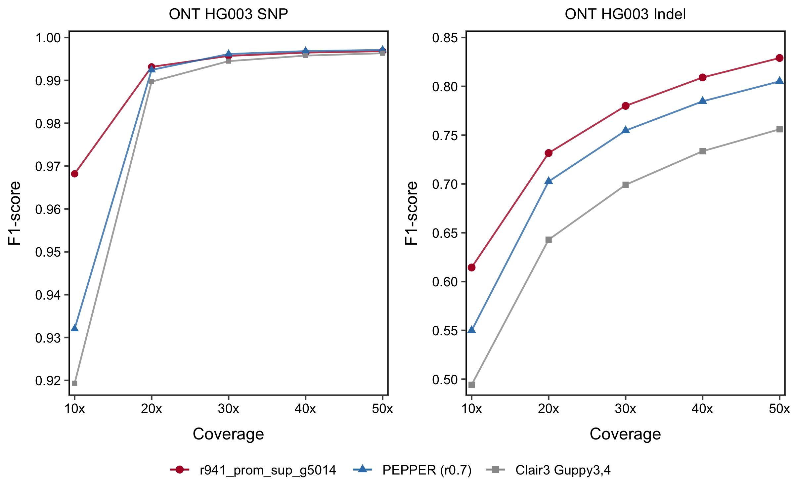
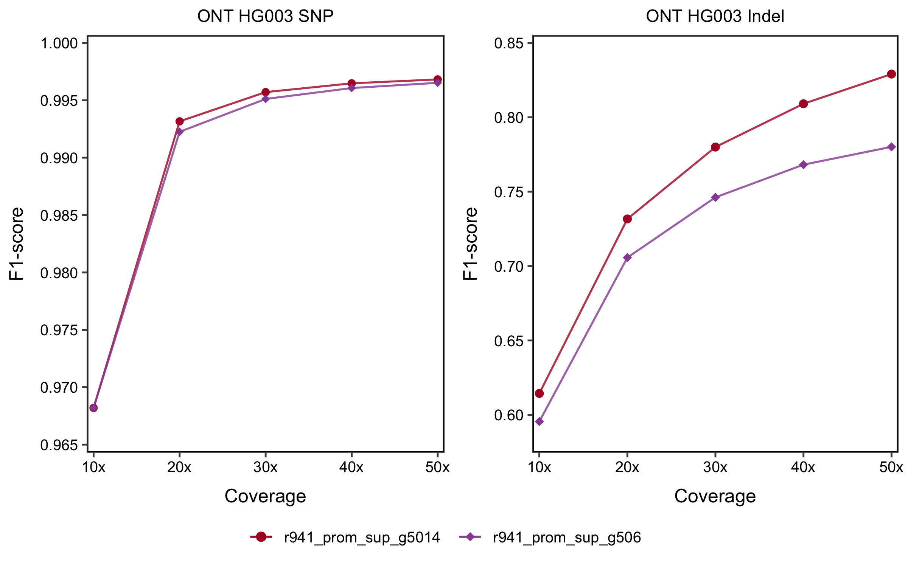

# Guppy5 model (r941_prom_sup_g5014)

You can use the Guppy5 model `r941_prom_sup_g5014` for Guppy6 data.

_Regarding to an old Guppy5 model `r941_prom_sup_g506` released on 20210609 fine-tuned from the Guppy3,4 model , please refer to [this document](guppy5.md)._

## Contents

* [About `r941_prom_sup_g5014`](#about-r941_prom_sup_g5014)
* [Shall we use a hac model or sup model for hac data?](#shall-we-use-a-hac-model-or-sup-model-for-hac-data)
* [How to use the Guppy5 model](#how-to-use-the-guppy5-model)
* [Guppy5 data used for training and testing](#guppy5-data-used-for-training-and-testing)

---

## About `r941_prom_sup_g5014`

*Jan 13, 2022.* In last June during the early release of [~70x Guppy5 HG002 data](https://labs.epi2me.io/gm24385_2021.05/), we released [the first Clair3 Guppy5 model](http://www.bio8.cs.hku.hk/clair3/clair3_models/r941_prom_sup_g506.tar.gz) `r941_prom_sup_g506` by fine-tuning the [Guppy3,4 model](http://www.bio8.cs.hku.hk/clair3/clair3_models/r941_prom_hac_g360+g422.tar.gz) with the new Guppy5 data. The improvement was [significant](guppy5.md) when applying the fine-tuned model to Guppy5 reads. But at that moment, without much Guppy5 data, we were unable to train a new model from scratch, and fine-tuning was the only option. 

To train a Guppy5 model from scratch, we basecalled four GIAB samples (HG002, 3, 4, 5) with fast5 available from the Human Pangenome Reference Consortium (HPRC) using Guppy5 and the `dna_r9.4.1_450bps_sup` mode. The basecalling took (quite) a while. Then, we trained a new Clair3 model `r941_prom_sup_g5014` using the training procedures detailed in [Pileup Model Training](pileup_training.md) and [Full-Alignment Model Training](full_alignment_training_r1.md).

We compared the new Guppy5 trained from scratch model `r941_prom_sup_g5014` against the old fine-tuned model `r941_prom_sup_g506`  and [PEPPER r0.7](https://github.com/kishwarshafin/pepper). The variant calling results of HG003 with input coverage from 10x to 50x are shown below. For the sake of comparison, the results of using Guppy4 data on the [Guppy3+4 model](http://www.bio8.cs.hku.hk/clair3/clair3_models/r941_prom_hac_g360+g422.tar.gz) `r941_prom_hac_g360+g422` are also shown. __Compared to `r941_prom_sup_g506`, `r941_prom_sup_g5014` on average has improved SNP F1-score by ~0.05% and Indel F1-score by ~3% .__





### HG003 WGS 10x performance:

| Model/<br/> Caller  | Testing<br/> Dataset | Overall<br/> Precision | Overall<br/>  Recall | Overall <br/> F1 | SNP<br/> Precision | SNP<br/>  Recall | SNP<br/>  F1 | Indel<br/> Precision | Indel<br/>  Recall | Indel<br/>  F1 |
| ------------------- | -------------------- | ---------------------- | -------------------- | ---------------- | ------------------ | ---------------- | ------------ | -------------------- | ------------------ | -------------- |
| r941_prom_sup_g5014 | Guppy5 sup 10x       | 96.01%                 | 90.21%               | 93.02%           | 97.11%             | 96.53%           | 96.82%       | 83.76%               | 48.51%             | 61.44%         |
| r941_prom_sup_g506  | Guppy5 sup 10x       | 97.38%                 | 88.86%               | 92.93%           | 98.19%             | 95.49%           | 96.82%       | 87.48%               | 45.14%             | 59.55%         |
| PEPPER (r0.7)       | Guppy5 sup 10x       | 96.39%                 | 82.91%               | 89.14%           | 97.54%             | 89.24%           | 93.20%       | 82.73%               | 41.17%             | 54.98%         |
| Guppy3+4            | Guppy4 hac 10x       | 88.96%                 | 86.11%               | 87.51%           | 90.55%             | 93.35%           | 91.93%       | 69.59%               | 38.32%             | 49.43%         |

### HG003 WGS 20x performance:

| Model/<br/> Caller  | Testing<br/> Dataset | Overall<br/> Precision | Overall<br/>  Recall | Overall <br/> F1 | SNP<br/> Precision | SNP<br/>  Recall | SNP<br/>  F1 | Indel<br/> Precision | Indel<br/>  Recall | Indel<br/>  F1 |
| ------------------- | -------------------- | ---------------------- | -------------------- | ---------------- | ------------------ | ---------------- | ------------ | -------------------- | ------------------ | -------------- |
| r941_prom_sup_g5014 | Guppy5 sup 20x       | 98.17%                 | 94.54%               | 96.32%           | 99.22%             | 99.42%           | 99.32%       | 88.56%               | 62.33%             | 73.17%         |
| r941_prom_sup_g506  | Guppy5 sup 20x       | 98.35%                 | 93.74%               | 95.99%           | 99.44%             | 99.01%           | 99.23%       | 87.90%               | 58.95%             | 70.57%         |
| PEPPER (r0.7)       | Guppy5 sup 20x       | 98.56%                 | 93.59%               | 96.01%           | 99.49%             | 99.00%           | 99.25%       | 89.35%               | 57.88%             | 70.25%         |
| Guppy3+4            | Guppy4 hac 20x       | 97.47%                 | 92.79%               | 95.07%           | 99.17%             | 98.77%           | 98.97%       | 80.91%               | 53.33%             | 64.29%         |

### HG003 WGS 30x performance:

| Model/<br/> Caller  | Testing<br/> Dataset | Overall<br/> Precision | Overall<br/>  Recall | Overall <br/> F1 | SNP<br/> Precision | SNP<br/>  Recall | SNP<br/>  F1 | Indel<br/> Precision | Indel<br/>  Recall | Indel<br/>  F1 |
| ------------------- | -------------------- | ---------------------- | -------------------- | ---------------- | ------------------ | ---------------- | ------------ | -------------------- | ------------------ | -------------- |
| r941_prom_sup_g5014 | Guppy5 sup 30x       | 98.56%                 | 95.55%               | 97.03%           | 99.49%             | 99.65%           | 99.57%       | 90.63%               | 68.46%             | 78.00%         |
| r941_prom_sup_g506  | Guppy5 sup 30x       | 98.27%                 | 94.95%               | 96.58%           | 99.60%             | 99.42%           | 99.51%       | 86.83%               | 65.42%             | 74.62%         |
| PEPPER (r0.7)       | Guppy5 sup 30x       | 98.77%                 | 94.96%               | 96.83%           | 99.68%             | 99.55%           | 99.62%       | 90.58%               | 64.68%             | 75.47%         |
| Guppy3+4            | Guppy4 hac 30x       | 98.13%                 | 94.10%               | 96.07%           | 99.50%             | 99.40%           | 99.45%       | 85.40%               | 59.18%             | 69.91%         |

### HG003 WGS 40x performance:

| Model/<br/> Caller  | Testing<br/> Dataset | Overall<br/> Precision | Overall<br/>  Recall | Overall <br/> F1 | SNP<br/> Precision | SNP<br/>  Recall | SNP<br/>  F1 | Indel<br/> Precision | Indel<br/>  Recall | Indel<br/>  F1 |
| ------------------- | -------------------- | ---------------------- | -------------------- | ---------------- | ------------------ | ---------------- | ------------ | -------------------- | ------------------ | -------------- |
| r941_prom_sup_g5014 | Guppy5 sup 40x       | 98.73%                 | 96.11%               | 97.40%           | 99.59%             | 99.70%           | 99.65%       | 91.71%               | 72.39%             | 80.91%         |
| r941_prom_sup_g506  | Guppy5 sup 40x       | 98.14%                 | 95.59%               | 96.85%           | 99.65%             | 99.56%           | 99.61%       | 86.01%               | 69.40%             | 76.82%         |
| PEPPER (r0.7)       | Guppy5 sup 40x       | 98.82%                 | 95.59%               | 97.18%           | 99.72%             | 99.65%           | 99.68%       | 91.19%               | 68.86%             | 78.47%         |
| Guppy3+4            | Guppy4 hac 40x       | 98.62%                 | 94.63%               | 96.58%           | 99.61%             | 99.55%           | 99.58%       | 89.47%               | 62.16%             | 73.36%         |

### HG003 WGS 50x performance:

| Model/<br/> Caller  | Testing<br/> Dataset | Overall<br/> Precision | Overall<br/>  Recall | Overall <br/> F1 | SNP<br/> Precision | SNP<br/>  Recall | SNP<br/>  F1 | Indel<br/> Precision | Indel<br/>  Recall | Indel<br/>  F1 |
| ------------------- | -------------------- | ---------------------- | -------------------- | ---------------- | ------------------ | ---------------- | ------------ | -------------------- | ------------------ | -------------- |
| r941_prom_sup_g5014 | Guppy5 sup 50x       | 98.80%                 | 96.52%               | 97.64%           | 99.63%             | 99.73%           | 99.68%       | 92.19%               | 75.32%             | 82.91%         |
| r941_prom_sup_g506  | Guppy5 sup 50x       | 97.99%                 | 95.99%               | 96.98%           | 99.66%             | 99.64%           | 99.65%       | 85.22%               | 71.93%             | 78.02%         |
| PEPPER (r0.7)       | Guppy5 sup 50x       | 98.86%                 | 96.01%               | 97.42%           | 99.74%             | 99.68%           | 99.71%       | 91.70%               | 71.76%             | 80.51%         |
| Guppy3+4            | Guppy4 sup hac 50x   | 98.79%                 | 95.01%               | 96.86%           | 99.67%             | 99.60%           | 99.63%       | 90.86%               | 64.73%             | 75.60%         |

---

## Shall we use a hac model or sup model for hac data?

__Conclusion first, use the sup model for hac data. But use sup data for the best performance.__  

Using the sup model for hac data, the overall F1 is 1.06% higher than using the hac model for hac data. Both SNP and Indel F1 were significantly better when using the sup model for hac data. But interestingly, both SNP recall and Indel recall were higher when the hac model was used for hac data. The result indicates that while some hac-data-specific characteristics have been learned by the hac model, the relatively higher noise in the hac data has hindered other characteristics shared between sup and hac data to be better learned. How to train a model that works best for hac data needs to be further explored, but the rule of thumb at the moment is to use the sup model for hac data.

### HG003 WGS 50x performance:

| Model                | Testing<br/> Dataset | Overall<br/> Precision | Overall<br/>  Recall | Overall <br/> F1 | SNP<br/> Precision | SNP<br/>  Recall | SNP<br/>  F1 | Indel<br/> Precision | Indel<br/>  Recall | Indel<br/>  F1 |
| -------------------- | -------------------- | ---------------------- | -------------------- | ---------------- | ------------------ | ---------------- | ------------ | -------------------- | ------------------ | -------------- |
| Guppy5 **sup** model | Guppy5 **sup** 50x   | 98.80%                 | 96.52%               | 97.64%           | 99.63%             | 99.73%           | 99.68%       | 92.19%               | 75.32%             | 82.91%         |
| Guppy5 **sup** model | Guppy5 **hac** 50x   | 98.12%                 | 95.91%               | 97.00%           | 99.64%             | 99.67%           | 99.65%       | 86.28%               | 71.12%             | 77.97%         |
| Guppy5 **hac** model | Guppy5 **hac** 50x   | 95.01%                 | 96.90%               | 95.94%           | 99.02%             | 99.77%           | 99.39%       | 71.30%               | 77.94%             | 74.47%         |
| Guppy5 **hac** model | Guppy5 **sup** 50x   | 94.93%                 | 96.80%               | 95.86%           | 99.07%             | 99.78%           | 99.42%       | 70.45%               | 77.19%             | 73.67%         |

---

## How to use the Guppy5 model

```
INPUT_DIR="[YOUR_INPUT_FOLDER]"           # e.g. /home/user1/input (absolute path needed)
OUTPUT_DIR="[YOUR_OUTPUT_FOLDER]"         # e.g. /home/user1/output (absolute path needed)
THREADS="[MAXIMUM_THREADS]"               # e.g. 8

docker run -it \
  -v ${INPUT_DIR}:${INPUT_DIR} \
  -v ${OUTPUT_DIR}:${OUTPUT_DIR} \
  hkubal/clair3:latest \
  /opt/bin/run_clair3.sh \
  --bam_fn=${INPUT_DIR}/input.bam \       ## change your bam file name here
  --ref_fn=${INPUT_DIR}/ref.fa \          ## change your reference name here
  --threads=${THREADS} \                  ## maximum threads to be used
  --platform="ont" \                       
  --model_path="/opt/models/r941_prom_sup_g5014" \
  --output=${OUTPUT_DIR}                  ## absolute output path prefix 
```

Check [Usage](https://github.com/HKU-BAL/Clair3#Usage) for more options.


## Guppy5 data used for training and testing

### FASTQs
[http://www.bio8.cs.hku.hk/guppy5_data/](http://www.bio8.cs.hku.hk/guppy5_data/)

### FAST5s
| Sample |   Reference   | Aligner  | Coverage |                   Basecaller                   | Training | Testing |                             link                             |
| :----: | :-----------: | :------: | :------: | :--------------------------------------------: | -------- | ------- | :----------------------------------------------------------: |
| HG002  | GRCh38_no_alt | minimap2 |   70.0   | Guppy v5.0.6 (dna_r9.4.1_450bps_sup_prom.cfg)  | Yes      |         |       [link](https://labs.epi2me.io/gm24385_2021.05/)        |
| HG002  | GRCh38_no_alt | minimap2 |  117.4   | Guppy v5.0.14 (dna_r9.4.1_450bps_sup_prom.cfg) | Yes      |         | [link](https://s3-us-west-2.amazonaws.com/human-pangenomics/index.html?prefix=NHGRI_UCSC_panel/HG002/nanopore/) |
| HG003  | GRCh38_no_alt | minimap2 |   77.1   | Guppy v5.0.14 (dna_r9.4.1_450bps_sup_prom.cfg) |          | Yes     | [link](https://s3-us-west-2.amazonaws.com/human-pangenomics/index.html?prefix=NHGRI_UCSC_panel/HG003/nanopore/) |
| HG003  | GRCh38_no_alt | minimap2 |   78.9   | Guppy v5.0.14 (dna_r9.4.1_450bps_hac_prom.cfg) |          | Yes     | [link](https://s3-us-west-2.amazonaws.com/human-pangenomics/index.html?prefix=NHGRI_UCSC_panel/HG003/nanopore/) |
| HG004  | GRCh38_no_alt | minimap2 |   79.0   | Guppy v5.0.14 (dna_r9.4.1_450bps_sup_prom.cfg) | Yes      |         | [link](https://s3-us-west-2.amazonaws.com/human-pangenomics/index.html?prefix=NHGRI_UCSC_panel/HG004/nanopore/) |
| HG005  | GRCh38_no_alt | minimap2 |   39.5   | Guppy v5.0.14 (dna_r9.4.1_450bps_sup_prom.cfg) | Yes      |         | [link](https://s3-us-west-2.amazonaws.com/human-pangenomics/index.html?prefix=NHGRI_UCSC_panel/HG005/nanopore/) |

