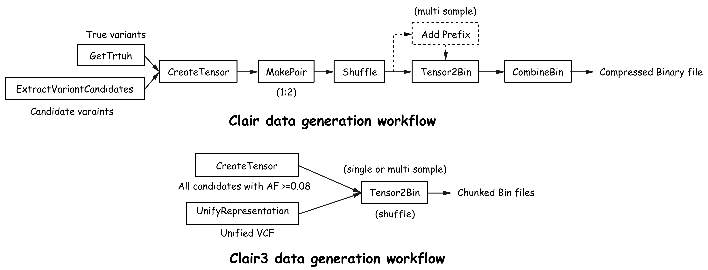

# Train a model for Clair3 pileup calling

This document shows how to train and fine-tune a deep-learning model for Clair3 pileup calling.  For training a model for full-alignment calling, please check [here](full_alignment_training.md). Clair3 needs both a pileup model and a full-alignment model to work. Compared to [Clair](https://github.com/HKU-BAL/Clair/blob/master/docs/TRAIN.md), the training workflow of Clair3 is simplified. The training materials are grouped according to sample, coverage, and chromosome. The groups are converted into tensor binaries. The binaries are much space-efficient and easier to process. As required, multiples tensor binaries can be used together for model training and fine-tuning. 



---

## Prerequisites

- Clair3 installed
- GNU Parallel installed
- Sufficient hard-disk space
- Truth VCF file after representation unification (check [here](https://github.com/HKU-BAL/Clair3/blob/main/docs/representation_unification.md) on how to generate unified VCF)
- A high-end GPU (have tested in RTX Titan, RTX 2080Ti, and GTX 1080Ti)

---

## Contents

* [I. Training data subsamping](#i-training-data-subsamping-recommended)
* [II. Build compressed binary files](#ii-build-compressed-binary-files-for-pileup-model-training)
    - [1. Setup variables](#1-setup-variables)
    - [2. Create working directories ](#2-create-temporary-working-folders-for-each-submodule)
    - [3. Split and extend bed regions](#3-split-bed-regions-using-the-splitextendbed-submodule)
    - [4. Get truth variants from unified VCF file](#4-get-truth-variants-from-unified-vcf-using-the-gettruth-submodule)
    - [5. Create pileup tensor](#5-create-pileup-tensor-using-the-createtrainingtensor-submodule)
    - [6. Merge compressed binaries](#6-merge-compressed-binaries-using-the-mergebin-submodule)
* [III. Model training](#iii-model-training)
    - [1. Pileup model training](#1-pileup-model-training)
    - [2. Pileup model fine-tune using pre-trained model](#2-pileup-model-fine-tune-using-pre-trained-model-optional)

---

## I. Training data subsamping

To build a training dataset with multiple coverages, we need to create multiple subsampled BAM files from the original full-depth BAM file.

```bash
# Please make sure the provided bam files are sorted and indexed
ALL_BAM_FILE_PATH=(
'hg002.bam'
'hg002.bam'
'hg002.bam'
)

# Each line represents one input sample name
ALL_SAMPLE=(
'hg002'
'hg002'
'hg002'
)

# Each line represents subsample ratio to each sample
## FRAC values for 'samtools view -s INT.FRAC'
## please refer to samtools' documentation for further information
## we set 90%, 60% and 30% of the full coverage as example
DEPTHS=(
900
600
300)

# Output folder to store all subsampled BAM
SUBSAMPLED_BAMS_FOLDER_PATH="[SUBSAMPLED_BAMS_FOLDER_PATH]"
mkdir -p ${SUBSAMPLED_BAMS_FOLDER_PATH}

# Other parameters
THREADS=8
THREADS_LOW=$((${THREADS}*3/4))
if [[ ${THREADS_LOW} < 1 ]]; then THREADS_LOW=1; fi
PARALLEL='parallel'
SAMTOOLS='samtools'

# Subsample BAM to specific depths in parallel
${PARALLEL} -j${THREADS} "${SAMTOOLS} view -@12 -s {2}.{2} -b -o ${SUBSAMPLED_BAMS_FOLDER_PATH}/{2}_{1}.bam {3}" ::: ${ALL_SAMPLE[@]} :::+ ${DEPTHS[@]} :::+ ${ALL_BAM_FILE_PATH[@]}
${PARALLEL} -j${THREADS} "${SAMTOOLS} index ${SUBSAMPLED_BAMS_FOLDER_PATH}/{2}_{1}.bam" ::: ${ALL_SAMPLE[@]} :::+ ${DEPTHS[@]}

# Add symbolic links for full coverage BAM and bai index
${PARALLEL} "ln -s {2} ${SUBSAMPLED_BAMS_FOLDER_PATH}/{1}_1000.bam" ::: ${ALL_SAMPLE[@]}  :::+ ${ALL_BAM_FILE_PATH[@]}
${PARALLEL} "ln -s {2}.bai ${SUBSAMPLED_BAMS_FOLDER_PATH}/{1}_1000.bam.bai" ::: ${ALL_SAMPLE[@]}  :::+ ${ALL_BAM_FILE_PATH[@]}

```

----

## II. Build compressed binary files for pileup model training

> - The whole procedure are breaking into blocks for better readability and error-tracing.
> - For each `parallel` command that run with the `--joblog` option, we can check the `Exitval` column from the job log output. If the column contains a non-zero value, it means error occurred; please rerun the failed block again.
> - We suggest using absolute path EVERYWHERE.
> - You can use a Truth VCF file without representation unification. You might want to do it only for testing because Clair3's performance would be significantly affected without representation unification.

This section shows how to build multiple compressed tensor binary files for multiple samples either with or without multiple coverages.

#### 1. Setup variables
```bash
# Setup executable variables
CLAIR3="clair3.py"                                       # clair3.py
PYPY="[PYPY_BIN_PATH]"                                   # e.g. pypy3
PYTHON3="[PYTHON3_BIN_PATH]"                             # e.g. python3
PARALLEL="[PARALLEL_BIN_PATH]"                           # e.g. parallel
SAMTOOLS="[SAMTOOLS_BIN_PATH]"                           # e.g. samtools

# Input parameters
PLATFORM="[SEQUENCING_PLATFORM]"                         # e.g. {ont, hifi, ilmn}
UNIFIED_VCF_FILE_PATH="[YOUR_VCF_FILE_PATH_ARRAY]"       # e.g. hg002.unified.vcf.gz
ALL_BAM_FILE_PATH="[YOUR_BAM_FILE_PATH_ARRAY]"           # e.g. hg002.bam
DEPTHS="[YOUR_DEPTHS_OF_SAMPLES_ARRAY]"                  # e.g. 1000 (means no subsample)
ALL_REFERENCE_FILE_PATH="[YOUR_FASTA_FILE_PATH_ARRAY]"   # e.g. hg002.fasta
ALL_BED_FILE_PATH="[YOUR_BED_FILE_PATH_ARRAY]"           # e.g. hg002.bed
ALL_SAMPLE="[YOUR_SAMPLE_NAME_ARRAY]"                    # e.g. hg002
OUTPUT_DIR="[YOUR_OUTPUT_FOLDER_PATH]"                   # e.g. output_folder

# Each line represent one input BAM with a matched coverage in the "DEPTH" array
## check the "Training data subsamping" section on how to apply BAM subsampling
ALL_BAM_FILE_PATH=(
'hg002_1000.bam'
'hg002_800.bam'
'hg004_1000.bam'
)

# Each line represents subsample ration to each sample, 1000 if no subsampling applies
DEPTHS=(
1000
800
1000
)

# Each line represents one input sample name
ALL_SAMPLE=(
'hg002'
'hg002'
'hg004'
)

# Each line represents the reference file of each sample
ALL_REFERENCE_FILE_PATH=(
'GRch38.fa'
'GRch38.fa'
'GRch38.fa'
)

# Each line represents one BED region file for each sample
ALL_BED_FILE_PATH=(
'hg002.bed'
'hg002.bed'
'hg004.bed'
)

# Each line represents one representation-unified VCF file for each sample
UNIFIED_VCF_FILE_PATH=(
'hg002_1000.unified.vcf.gz'
'hg002_800.unified.vcf.gz'
'hg004_1000.unified.vcf.gz'
)

# Chromosome prefix ("chr" if chromosome names have the "chr" prefix)
CHR_PREFIX="chr"

# array of chromosomes (do not include tge "chr" prefix) to train in all sample
## pls note that in the pretrained Clair3 models, we have excluded chr20 as a hold-out set.
CHR=(21 22)

# Number of threads to be used
THREADS=8

# Number of chucks to be divided into for parallel processing
chunk_num=15
CHUNK_LIST=`seq 1 ${chunk_num}`

# The number of chucks to be divided for bin file generation for parallel processing
bin_chunk_num=1
BIN_CHUNK_LIST=`seq 1 ${bin_chunk_num}`

# Minimum SNP and INDEL AF required for a candidate variant
MIN_SNP_AF=0.08
MIN_INDEL_AF=0.15

# Maximum non-variant ratio for pileup model training, for pileup model training, we use variant:non-variant = 1:5
MAXIMUM_NON_VARIANT_RATIO=5

```

#### 2. Create temporary working folders for each submodule
```bash
# Temporary working directories
DATASET_FOLDER_PATH="${OUTPUT_DIR}/build"
TENSOR_CANDIDATE_PATH="${DATASET_FOLDER_PATH}/tensor_can"
BINS_FOLDER_PATH="${DATASET_FOLDER_PATH}/bins"
SPLIT_BED_PATH="${DATASET_FOLDER_PATH}/split_beds"
VAR_OUTPUT_PATH="${DATASET_FOLDER_PATH}/var"

mkdir -p ${DATASET_FOLDER_PATH}
mkdir -p ${TENSOR_CANDIDATE_PATH}
mkdir -p ${BINS_FOLDER_PATH}
mkdir -p ${SPLIT_BED_PATH}
mkdir -p ${VAR_OUTPUT_PATH}

```

#### 3. Split and extend bed regions using the `SplitExtendBed` submodule
```bash
cd ${OUTPUT_DIR}

# Split BED file regions according to the contig names and extend the bed regions
${PARALLEL} --joblog ${DATASET_FOLDER_PATH}/split_extend_bed.log -j${THREADS} \
"${PYPY} ${CLAIR3} SplitExtendBed \
    --bed_fn {4} \
    --output_fn ${SPLIT_BED_PATH}/{2}_{3}_{1} \
    --ctgName ${CHR_PREFIX}{1}" ::: ${CHR[@]} ::: ${ALL_SAMPLE[@]} :::+ ${DEPTHS[@]} :::+ ${ALL_BED_FILE_PATH[@]}
    
```

#### 4. Get truth variants from unified VCF using the `GetTruth` submodule

```bash
${PARALLEL} --joblog ${VAR_OUTPUT_PATH}/get_truth.log -j${THREADS} \
"${PYPY} ${CLAIR3} GetTruth \
    --vcf_fn {4} \
    --ctgName ${CHR_PREFIX}{1} \
    --var_fn ${VAR_OUTPUT_PATH}/var_{2}_{3}_{1}" ::: ${CHR[@]} ::: ${ALL_SAMPLE[@]} :::+ ${DEPTHS[@]} :::+ ${UNIFIED_VCF_FILE_PATH[@]}

```

#### 5. Create pileup tensor using the `CreateTrainingTensor` submodule

```bash
# Create pileup tensor for model training
${PARALLEL} --joblog ${DATASET_FOLDER_PATH}/create_tensor_pileup.log -j${THREADS_LOW} \
"${PYPY} ${CLAIR3} CreateTrainingTensor \
    --bam_fn {4} \
    --ref_fn {5} \
    --var_fn ${VAR_OUTPUT_PATH}/var_{2}_{3}_{1} \
    --bin_fn ${TENSOR_CANDIDATE_PATH}/tensor_{2}_{3}_{1}_{7} \
    --ctgName ${CHR_PREFIX}{1} \
    --samtools ${SAMTOOLS} \
    --snp_min_af ${MIN_SNP_AF} \
    --indel_min_af ${MIN_INDEL_AF} \
    --extend_bed ${SPLIT_BED_PATH}/{2}_{3}_{1} \
    --bed_fn {6} \
    --pileup \
    --platform ${PLATFORM} \
    --shuffle \
    --maximum_non_variant_ratio ${MAXIMUM_NON_VARIANT_RATIO} \
    --chunk_id {7} \
    --chunk_num ${chunk_num}" ::: ${CHR[@]} ::: ${ALL_SAMPLE[@]} :::+ ${DEPTHS[@]} :::+ ${ALL_BAM_FILE_PATH[@]} :::+ ${ALL_REFERENCE_FILE_PATH[@]} :::+ ${ALL_BED_FILE_PATH[@]} ::: ${CHUNK_LIST[@]} |& tee  ${DATASET_FOLDER_PATH}/CTP.log

```

**Options**

 - `--allow_duplicate_chr_pos` : for multiple coverages training, this option is required to to allow different coverage training samples at the same variant site.
 - `--shuffle` :  as the input tensors are created in the order of starting positions, this option shuffles the training data in each chunk. During the training process, we also apply index reshuffling in each epoch.
 - `--maximum_non_variant_ratio` :  we set a maximum non-variant ratio (variant:non-variant = 1:5) for pileup model training, non-variants are randomly selected from the candidate set if the ratio is exceeded, or all non-variants will be used for training otherwise. 
 - `--max_depth` :  set the depth cap of every genome position. Pileup input summarizes position-level read alignments where depth information varies in the training materials. If not contrained by computational resources, we recommend setting the depth cap to the maximum depth coverage of the training materials.

#### 6. Merge compressed binaries using the `MergeBin` submodule

```bash
# Merge compressed binaries
${PARALLEL} --joblog ${DATASET_FOLDER_PATH}/mergeBin.log -j${THREADS} \
"${PYTHON3} ${CLAIR3} MergeBin \
    ${TENSOR_CANDIDATE_PATH}/tensor_{2}_{3}_{1}_* \
    --out_fn ${BINS_FOLDER_PATH}/bin_{2}_{3}_{1} \
    --pileup" ::: ${CHR[@]} ::: ${ALL_SAMPLE[@]} :::+ ${DEPTHS[@]}

```

----

## III. Model training

We provide two optional training mode:

​	**Option1**: Train  pileup model using new dataset, in this mode, we will use randomly initialized model weights and train the model until reaches max epochs(30) or converge.

​    **Option2**: Fine-tune pileup model using pre-trained parameters and choose a smaller learning rate for better converge in new dataset.

***We recommend using the fine-tune mode (option 2) for better robustness.***

#### 1. Pileup model training (option 1)

```bash
MODEL_FOLDER_PATH="${OUTPUT_DIR}/train"
mkdir -p ${MODEL_FOLDER_PATH}

cd ${MODEL_FOLDER_PATH}

# A single GPU is used for model training
export CUDA_VISIBLE_DEVICES="0"
${PYTHON3} ${CLAIR3} Train \
    --bin_fn ${BINS_FOLDER_PATH} \
    --ochk_prefix ${MODEL_FOLDER_PATH}/pileup \
    --pileup \
    --add_indel_length False \
    --random_validation \
    --platform ${PLATFORM}

```

**Options**

 - `--pileup` : enable pileup model training mode. (enable full-alignment mode if the option is not set).
 - `--add_indel_length` :  enable or disable the two indel-length tasks. In the pre-trained models, the two tasks are disabled in pileup calling.
 - `--random_validation`: randomly holdout 10% from all candidate sites as validation data, the best-performing epoch on the validation data are selected as our pre-trained models.

#### 2. Pileup model fine-tune using pre-trained model (option 2)

```bash
# Pileup model fine-tuning using a new sample
MODEL_FOLDER_PATH="${OUTPUT_DIR}/train"
mkdir -p ${MODEL_FOLDER_PATH}

cd ${MODEL_FOLDER_PATH}

export CUDA_VISIBLE_DEVICES="0"
${PYTHON3} ${CLAIR3} Train \
    --pileup \
    --bin_fn ${BINS_FOLDER_PATH} \
    --ochk_prefix ${MODEL_FOLDER_PATH}/pileup \
    --add_indel_length False \
    --random_validation \
    --platform ${PLATFORM} \
    --learning_rate 0.0001 \
    --chkpnt_fn "[YOUR_PRETRAINED_MODEL]"  ## use pre-trained pileup model here
 
```

We experimentally offer pileup model fine tuning using a pre-trained Clair3 pileup model, by using a smaller `learning_rate` and a pre-trained model `chkpnt_fn`. We recommend starting with a smaller learning rate such as `1e-4` to fine-tune a pre-trained pileup model.
